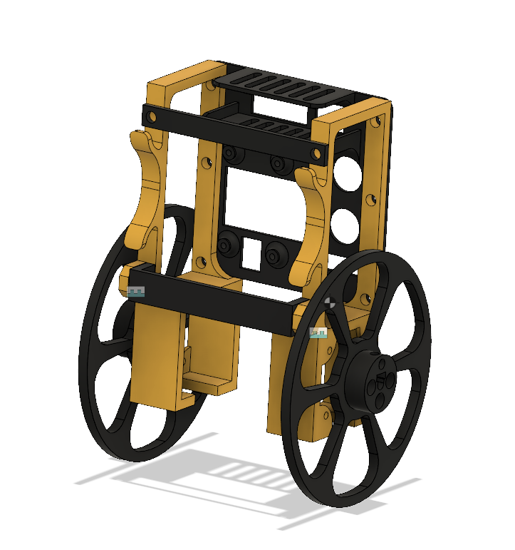

Segway Bot
==========

This robot can balance on 2 wheels for 30 seconds. It runs on an Arduino Nano and uses [9-DOF IMU](https://learn.adafruit.com/adafruit-9-dof-imu-breakout) and 2x NEMA 17 stepper motors. 

## General working principle

1. Take data in from the accelerometer (noisy absolute pitch) and gyroscope (smooth delta-pitch).
2. Fuse the data together with a complementary filter to get relatively un-noisy absolute pitch.
3. Calculate the error and feed it into a PID loop.
4. Feed the PID data into the stepper motors.

## Problems encountered

- The sensors are extremely noisy. They tended to get even noisier when the stepper motors were active. This was mitigated by using a physical low-pass isolation medium (fancy term for a piece of foam between the frame and the IMU). 
- The wheels, being slippery PLA plastic, have very low traction. This was mitigated by adding a metaphorical warning label to the robot saying that it can't be used on smooth surfaces, but it does very well on carpet.

## Links

- [Drawings and schematic](https://drive.google.com/file/d/10ludiSeHadmGEeyNP80GLPzTC48ZILxc/view?usp=sharing)
- [CAD Model](https://a360.co/2mIKGgh) (Slightly outdated, as it mentions a MPU6050 instead of a LSM303DLHC/L3GD20 system, but it's I2C so it's still compatible.)
